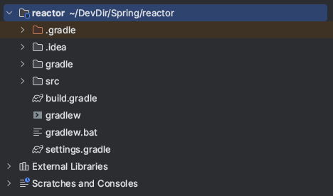
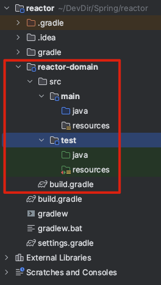

## 왜 멀티 모듈 프로젝트인가?
- 하나의 프로젝트 하위에 모든 클래스들이 존재한다면, 이는 프로젝트 복잡도를 증가 시킨다.
  - 이때, 공통의 역할을 하는 클래스끼리 한곳에 모아서 관리하면 복잡도를 낮출 수 있다.
- 활용할 수 있는 방안이 하나의 프로젝트에 역할별로 ***하위 모듈을 만들어 클래스들을 관리***하는 것이다.
  - ex) project-core 모듈, project-domain 모듈, project-app 모듈, project-web 모듈

## 설정 방법
### 1. Root 프로젝트 생성 및 설정
- 신규 gradle 프로젝트를 생성하면 아래와 같은 구조를 확인 할 수 있음


1. `src` 디렉토리를 삭제 (root 프로젝트에서는 코드 구현을 하지 않을것이기 때문에)
2. build.gradle 설정
   - root project에 있는 build.gradle 파일에는 ***sub module project 에서 공통으로 사용할 설정***을 지정
```groovy
plugins {
    id 'java'
    id 'org.springframework.boot' version '2.7.0'
}

subprojects {
    group 'me.mouseeye'
    version '1.0-SNAPSHOT'
    sourceCompatibility = '17'

    apply plugin: 'java'
    apply plugin: 'java-library'
    apply plugin: 'org.springframework.boot'
    apply plugin: 'io.spring.dependency-management'

    repositories {
        mavenCentral()
    }

    dependencies {
        compileOnly 'org.projectlombok:lombok'
        annotationProcessor 'org.projectlombok:lombok'

    }

    test {
        useJUnitPlatform()
    }

}
```
- plugins : plugin(gradle task의 집합) 정의
- subprojects : sub module project 하위에 공통으로 적용할 설정들을 지정
  - group / version : project packaging 기본 정보
  - sourceCompatibility : project에서 사용할 java version
  - apply plugin : plugin 적용
    - java : java build 관련 task
    - java-library : dependencies 내부에 api 옵션 사용
    - org.springframework.boot : spring boot task 관련 옵션
    - io.spring.dependency-management : spring 자동 연존성 관리
  - repositories : library 를 불러올 저장소
  - dependencies : sub module project에 공통으로 적용할 library
  - test {useJUnitPlatform()} : JUnit test 활성화

### 2. 하위 모듈 생성
1. 공통으로 사용할 모듈 생성

- build.gradle 수정
```groovy
bootJar {
    enabled false
}

dependencies {}
```
- 공통 모듈은 main method가 있는 실행 가능한 모듈이 아니기 때문에, `bootJar.enabled` 옵션을 `false`로 지정해줘야 한다.

2. 앱 모듈 생성 (공통 모듈을 사용할)
- 공통 모듈 생성하는 방식과 동일하게 "reactor-server" 모듈 생성
- build.gradle 수정
```groovy
bootJar {
    enabled = true
    archiveFileName = 'app.jar' // 패키징될 파일 이름
}

dependencies {
    implementation project(':reactor-domain') // project-domain 프로젝트 사용
    implementation 'org.springframework.boot:spring-boot-starter-webflux'
}
```
- bootJar.enabled = true : main method로 실행할 모듈이므로 true
- bootJar.archiveFileName : 패키징될 최종 파일 이름 지정
- implementation project(':reactor-domain') : 공통 모듈(reactor-domain) 사용
