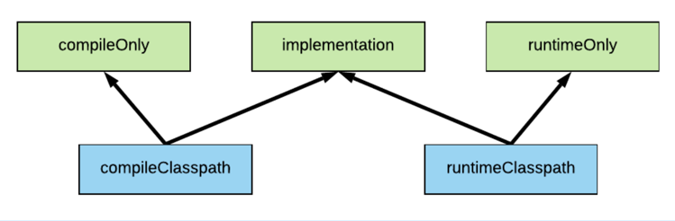
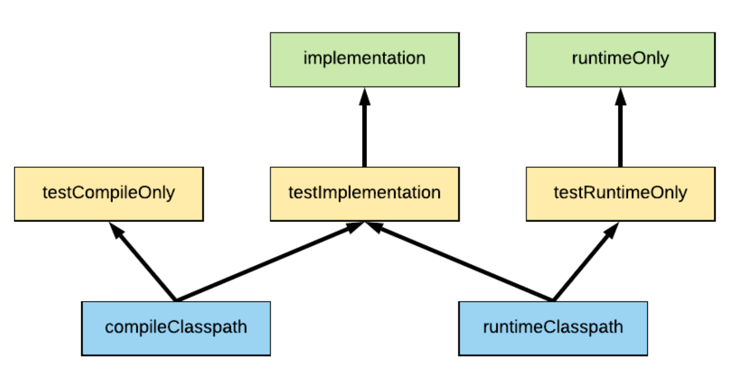
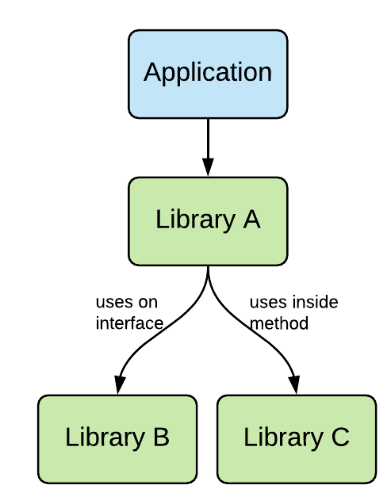

### Gradle dependencies를 설정하는 방법

Gradle의 dependencies 블락을 설정할 때, 우리가 해야되는 일은 library가 어떤 classpath 단계에서 필요한지 나타내는 일 뿐이다. 이러한 관점에서 봤을때, 우리가 사용할 수 있는 option은 3가지 입니다.

- compileOnly : library 의존성을 compile classpath에만 지정
- runtimeOnly : library 의존성을 runtime classpath에만 지정
- implementation : library 의존성을 compile + runtime classpath에 지정



위와 같이 특정 classpath에만 의존성을 추가하면, 아래와 같은 이점을 얻을 수 있습니다.
- 만약 적은 compile classpath 의존성을 가지고 있다면, ***더 적은 compile time이 소요 될 것 입니다.***
- 코드를 작성할 때, ***runtime 의존성을 갖는 코드를 실수로 사용하지 않을것 입니다.***
- ***복잡한 library 의존관계를 줄 일 수*** 있습니다.

추가적으로 test 의존성을 위한 전용 `testRuntimeOnly`, `testImplementation,` `testCompileOnly` 키워드가 있습니다.
아래와 같은 classpath 의존성을 가지고 있습니다.


```text
Java project를 빌드하고 실행 할때, 2가지 classpath가 있습니다 :
 - Compile classpath : JDK가 Java code를 .class file로 compile할 때 필요한 의존성
 - Runtime classpath : 컴파일된 Java code를 실행할 때 필요한 의존성
```

### api 키워드.. (java library 개발 시 고려해야할..)
다른 Gradle project에서 사용될 library를 개발 하는 경우, 추가로 사용할 수 있는 키워드인 `api`가 있습니다.
- implementation
  - consumer library에서 runtime classpath에서 사용 가능
  - Library 내부에서만 사용하는 library의 의존성을 설정할 때 사용
- api : compile and runtime classpaths of the consumer library
  - consumer library에서 runtime & compile classpath에서 사용 가능
  - Library 외부에서 노출되어 Consumer library에서 사용 가능한 의존성을 설정 할 때 정의


- ex) A (Consumer library) -> B (Library B) -> implementation C (library C)
                                            -> api D (library D)
  - 위 상황일때,
    - **B library** 에서 C를 **implementation 'C'로 정의** 했다면,
      - A에서는 C를 compile time에 참조할 수 없다.
    - B library 에서 C를 api 'D'로 정의 했다면,
      - A에서는 D를 compile & runtime 모두 참조 가능 하다.


### 참고자료
- https://tomgregory.com/gradle-implementation-vs-compile-dependencies/
- https://tomgregory.com/how-to-use-gradle-api-vs-implementation-dependencies-with-the-java-library-plugin/


