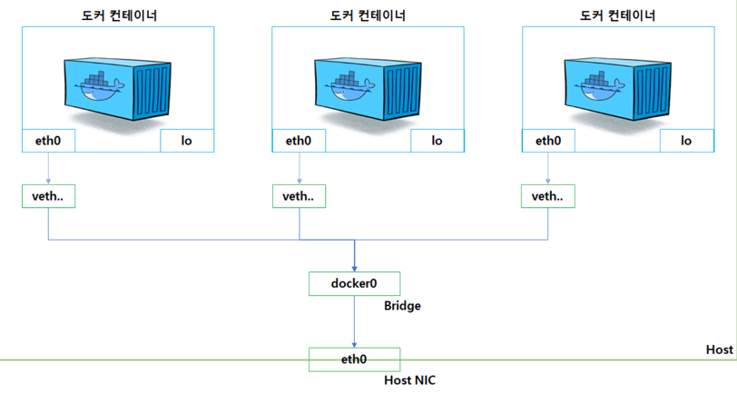

### 도커 네트워크 구조

- 도커는 컨테이너에 내부 IP를 순차적으로 할당
  - 할당되는 IP는 컨테이너 내부의 eth0 네트워크 인터페이스에 할당되며, 172.17.0.x 순차적으로 할당됨
  - 내부 IP는 컨테이너가 재시작 할때마다 변경 될 수 있음
- 호스트에는 컨테이너의 내부 IP를 외부로 연결시켜주는 가상 네트워크 인터페이스가 있음 -> veth0
- veth0는 docker0 브릿지를 통해서 host의 eth0와 바인딩되어 있으며, 외부로 통신이 가능함
- veth는
  - `virtual ethernet interface`의 약자로 실제로 랜카드에 연결된 네트워크 인터페이스는 아님
  - 다른 네트워크 인터페이스간 패킷이 이동할 수 있도록 돕는 브릿지 역할을 담당
  - 도커 호스트에서는 컨테이너 갯수 만큼 veth이 생성됨

### 도커 네트워크 기능
- 기본적으로 앞서 설명한 docker0 브릿지를 통해서 외부와 통신 할 수 있지만,
- 모든 컨테이너가 하나의 네트워크 인터페이스로 연결되어 있기 때문에 안전한 방법이 아님
- `bridge, host, none, container, overlay` 등으로도 외부와 연결 가능
  - 단일 호스트 네트워크 드라이버 : `bridge`, `host`, `none`
  - 다중 호스트 네트워크 드라이버 : `overlay`

#### bridge
- custom bridge를 생성하여 컨테이너와 연결
- 브릿지 네트워크 생성 : `docker network create --driver bridge mybridge`
- 브릿지 네트워크 연결 : `docker run -d --name test --net mybridge ubuntu:latest`
- 브릿지 네트워크 연결2 : `docker network connect mybridge mynetwork_container` / `docker network connect [bridge network 이름] [container 이름]
- 브릿지 네트워크 해제 : `docker network disconnect mybridge mynetwork_container` / `docker network connect [bridge network 이름] [container 이름]

#### host
- docker run -i -t --name host_container --net host ubuntu:latest
- 시작하면, host의 네트워크 환경을 그대로 사용 가능

#### none
- docker run -i -t --name host_container --net none ubuntu:latest
- 아무런 네트워크를 사용하지 않는 설정

#### container
- docker run -i -t --name host_container --net container:[컨테이너 이름] ubuntu:latest
- `docker run -i -t --name host_container --net container:[host_container] ubuntu:latest`
- 다른 컨테이너의 내부 IP / Mac 주소 등 네트워크 네임스페이스를 공유

#### overlay
- 여러개의 호스트에 걸쳐 있는 네트워크
