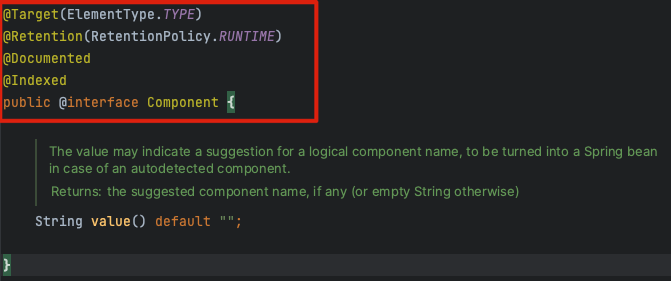

> Java Annotation 을 활용하여 `compile time, runtime` Java 파일 조작을 한다.
> Annotation 생성시에 사용되는 옵션으로 @Target / @Retention / @Documented / @Inherited 가 있음
> @interface type 으로 생성 해야됨


### @Target
- Annotation 사용 가능한 위치 지정
- 이렇게 많은 타입들이 있다..
  - 의미 그대로, TYPE은 class, enum, interface 등의 정의 타입에 지정 가능, FIELD는 필드, METHOD는 함수, PARAMETER는 매개변수
  - default는 모든 대상
```java
public enum ElementType {
    TYPE,
    FIELD,
    METHOD,
    PARAMETER,
    CONSTRUCTOR,
    LOCAL_VARIABLE,
    ANNOTATION_TYPE,
    PACKAGE,
    TYPE_PARAMETER,
    TYPE_USE,
    MODULE,
    RECORD_COMPONENT;
}
```

### @Retention
- Annotation 의 지속 시간 설정
- SOURCE / CLASS / RUNTIME 3가지 속성이 있음
- .java 파일 -> compile -> class 파일 -> class loader -> runtime env 과정에서 다음과 같은 의미를 가짐
  - SOURCE : java 파일 시점 까지만 ex) @Override
  - CLASS : byte code 까지만
  - RUNTIME : 실행 환경에서도 ex) @Controller

### @Documented
- java doc에 문서화 할지

### @Inherited
- 자식 클래스에 상속 할지
