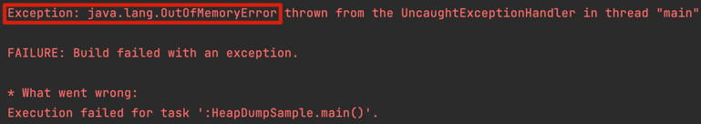
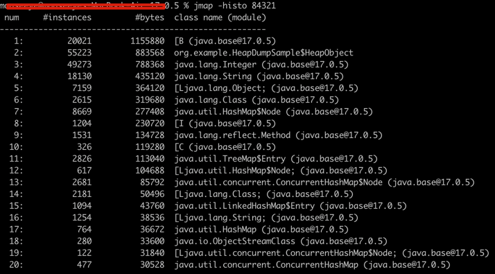

## OutOfMemoryError와 Heap dump


Application을 운영하다 보면 위와 같이 OutOfMemoryError가 발생 했다는 에러 로그를 본적이 있을 것 이다.
OutOfMemoryError는 아래와 같은 사유로 발생 할 수 있다.
1. 자바 애플리케이션이 처리할 데이터에 비해 ***heap memory가 작게 설정된 경우***
   - 일반적으로 더 많은 메모리를 할당하여 해결 할 수 있다.
   - ex) -Xmx4G -> -Xmx8G
2. ***memory leak***이 존재 할 경우
   - memory leak을 발생 시키는 코드 제거

위와 같은 Error가 발생 할 경우 Heap dump라는 분석 파일을 생성하여 원인을 찾아 볼 수 있다.
(뿐만 아니라, 우리의 애플리케이션에서 어떤 데이터들이 메모리를 많이 점유하고 있는지 확인을 위해 사용할 수 있다.)

## Heap dump 생성
- Heap dump는 Heap memory 생성 시점의 스냅샷이다.
- Heap memory에 적재된 객체에 대해 아래 내용을 확인 할 수 있다.
  - 어떤 값이 할당 되어 있는지,
  - 크기는 얼마 인지
- `jmap` 명령어로 Heap dump를 생성 할 수 있다.
> jmap --dump:format=b,file=heap.hprof -histo [PID]
  - -histo 죽은 객체까지 포함하여 heap dump가 생성된다.

> jmap --dump:format=b,file=heap.hprof -histo:live [PID]
  - Full GC를 발생 시킨 후, 살아 남은 객체로 heap dump를 생성한다.
  - 서비스 중인 프로그램에선 신중하게 사용해야됨
- `jps` 또는 `ps -ef` 명령어로 PID 정보 확인


- 위 캡쳐는 `jmap`의 실행 결과이다. [L, [B와 같은것 들이 있는데, 아래와 같은 의미를 띤다.
```text
[C is a char[]
[S is a short[]
[I is a int[]
[B is a byte[]
[[I is a int[][]
```
