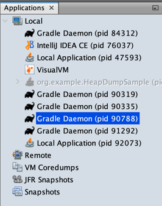
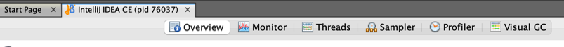
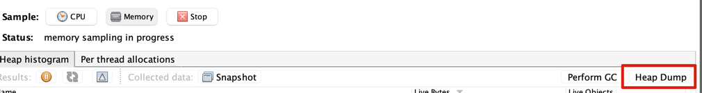
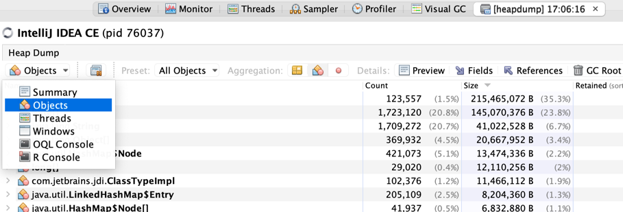

자바 애플리케이션의 OS, CPU, Thread, Memory 등 여러 리소스를 모니터링 하려면 `JMX(Java Management Extensions)`를 사용할 수 있다.
`JMX`는 실행 중인 애플리케이션의 **상태 모니터링, 설정 변경 등** 을 할 수 있게 해주는 **인터페이스**이다.
또한 로컬 또는 원격에 있는 자바 애플리케이션에 모두 사용 할 수 있는 기술이다.

기회가 된다면 Mbean, JMX 아키텍쳐 등 세부적인 내용들을 정리 해보겠다.
이번엔 JMX를 활용하여 **모니터링 결과를 시각화** 해주는 툴인 `Visual VM`에 대해서 다뤄보겠다.

## JMX 설정
자바 애플리케이션을 **Visual VM을 사용해 모니터링** 하려면, JMX 관련 **vm 옵션들을 활성화** 해야된다.

#### JMX VM 옵션
- `com.sun.management.jmxremote=true` : jmx 인터페이스를 사용해 자바 애플리케이션 접근을 활성화 하는 옵션
- `com.sun.management.jmxremote.authenticate=false` : 자바 애플리케이션에 접근 할때 **인증 처리 활성화** 옵션
- `com.sun.management.jmxremote.ssl=false` : 자바 애플리케이션에 접근 할때 **SSL 통신 활성화** 옵션
- `java.rmi.server.hostname=<ip_address>` : 원격지에 있는 자바 애플리케이션의 hostname (IP 주소 또는 분산 환경이 아니라면 도메인 주소도 가능)
- `com.sun.management.jmxremote.port=<jmx_port>` : jmx 인터페이스에서 사용할 port 번호

위 옵션들은 **특정 애플리케이션에만 설정하는 방법**과 **전역으로 설정하는 방법** 두가지가 있다.
JVM이 구동되는 환경에서 특정 애플리케이션만 설정하는 방법은
단순히 자바 애플리케이션에 위 vm 옵션을 설정해서 실행하면 된다.
> java SampleApplication -Dcom.sun.management.jmxremote -Dcom.sun.management.jmxremote.port=[jmx remote port] -Dcom.sun.management.jmxremote.ssl=false -Dcom.sun.management.jmxremote.authenticate=false -Djava.rmi.server.hostname=[hostname or ip]

JVM이 구동되는 JAVA Home의 `${JAVA_HOME}/conf/management/` 파일들을 이용해서 전역으로 설정 가능하다.
해당 경로에서 아래의 파일들을 확인 할 수 있다.
1. `management.properties`
  - 전역적으로 설정할 수 있는 시스템 변수들이 주석 처리되어 있다.
  - 사용하고 싶다면, 주석 해제를 하고, 값을 지정해서 사용하면 된다.
  - `managemnet.properties` 파일 내 실제 내용 중 일부...
```shell
#
# ###################### RMI SSL #############################
#
# com.sun.management.jmxremote.ssl=true|false
#      Default for this property is true. (Case for true/false ignored)
#      If this property is specified as false then SSL is not used.
#
```

2. `jmxremote.access`
  - 사용자 역할과 관련된 액새스 권한을 정의하는 파일
  - `com.sun.management.jmxremote.authenticate` 옵션이 true 일 경우 JVM 구동되는 환경에서 전역적으로 설정 가능
  - 사용자와 액새스 권한 설정 예시 (monitorRoleUser에게 readonly 권한 / controlRoleUser에게 readwrite 권한)
```text
monitorRoleUser readonly
controlRoleUser readwrite \
    create javax.management.monitor.*,javax.management.timer.* \
    unregister
```
3. `jmxremote.password`
  - 사용자 및 비밀번호 설정을 위한 파일
  - `com.sun.management.jmxremote.authenticate` 옵션이 true 일 경우 JVM 구동되는 환경에서 전역적으로 설정 가능
  - 파일은 반드시 소유자만 읽기 권한이 있어야됨, 그렇지 않으면 실행이 불가함
    - `chmod u+r [filename]`
  - 사용자와 비밀번호 설정 예시
```text
monitorRoleUser  pass1
controlRoleUser  pass2
```
---

## VisualVM
위 설정들과 함께 자바 애플리케이션을 실행을 하면, VisualVM, JConsole, JMC 등 모니터링 도구를 통해서 시각화된 애플리케이션 리소스 사용량을 확인 할 수 있다.
여기서는 VisualVM을 이용해서 확인해 보겠다.

#### VisualVM 다운로드 및 설치
- https://visualvm.github.io/download.html 에 접속하여 OS 버전에 맞는 VisualVM 파일을 다운로드 하여 설치

#### 자바 애플리케이션 연결
- 설치를 완료하고, VisualVM을 설치하면 아래와 같은 main 화면이 나타난다.
- main 화면에 왼쪽 `Application` 영역 `local`탭에서 현재 접속 가능한 자바 프로세스의 목록들을 확인 할 수 있다.
  - Gradle task, IntelliJ도 목록에 나타난다. java로 만들어진 애플리케이션인가 보다..




- 리소스 조회를 하고자 하는 자바 애플리케이션을 double click 하면 아래와 같은 목록들을 확인 할 수 있다. (여기선 IntelliJ 애플리케이션의 리소스를 조회 해보겠다.)



#### VisualVM으로 dump 뜨기
- 메뉴 탭에서 `Sampler -> Sample -> Thread or Heap` 메뉴에서 thread dump / heap dump를 생성할 수 있다.
- heap dump 시에 full GC가 발생한다. (아마 jmap -histo:live 명령어로 덤프를 생성 하나보다..)



- heap dump를 생성하면 메뉴에 `[heapdump] timexxx`과 같은 방금 생성한 heap dump를 조회할 수 있는 메뉴가 생성된다.
- 해당 메뉴 `Object` 기능에서 Object의 상세한 정보들을 확인 할 수 있다. object별 heap memory 점유율 / size 등등




https://blog.naver.com/pcmola/222038466393
https://cselabnotes.com/kr/2021/03/26/39/
https://lp.jetbrains.com/intellij-idea-profiler/
https://www.jetbrains.com/help/idea/profiler-intro.html
https://blog.jetbrains.com/idea/2020/03/profiling-tools-and-intellij-idea-ultimate/
