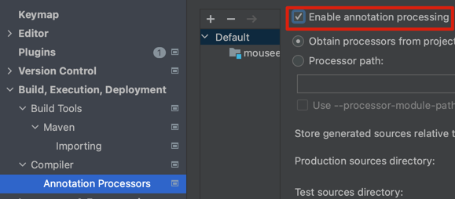

### JMH
- JVM을 타깃으로 하는 언어로 작성된 마이크로벤치마킹를 코드 작성, 실행, 분석하는 자바 도구
- JIT compiler의 죽은 코드 최적화 / 상수 폴딩 등으로 벤치마크 결과에 영향을 받을 수 있는 상황으로 부터 보호 가능

#### Gradle 환경에서 JMH 사용
1. `build.gradle` 내 JMH Plugin 추가
```groovy
plugins {
  id "me.champeau.jmh" version "0.6.8"
}
```
- 0.6.0 이하의 버전은 `me.champeau.gradle.jmh` id를 사용한다.

2. Annotation Processing 활성화
jmh는 유저가 설정한 annotation을 reflection을 통해 벤치 마크 코드를 생성하기 때문에, annotation processing 기능 활성화가 필요하다.


| Annotation      | 설명                                                                                                                                   |
|-----------------|--------------------------------------------------------------------------------------------------------------------------------------|
| @Benchmark      | - benchmark test하고자 하는 메소드에 선언                                                                                                       |
| @BenchmarkMode  | - benchmark로 측정하고자 하는 정보 선언<br/> - Mode.Throughput : 처리량 / Mode.AverageTime : 평균 수행 시간 / Mode.SampleTime : max, min 등 시간과 관련된 성능 데이터 |
| @Fork           | - `value` : benchmark iteration 수행시 fork 횟수 선언 / warmup : warn up 수행시 fork 횟수 선언 / jvmArgs : fork된 operation에서 사용할 jvm arguments 설정  |
| @Warmup         | - warn up 관련 설정 선언 <br/> - interations : 반복 횟수 / time = warn up 수행 시간, 수행 시간 초과시 스코어 계산 대상에서 제외 / timeUnit = time 변수 단위)             |
| @Measurement    | - iteration 관련 설정 선언 <br/> - interations : 반복 횟수 / time = warn up 수행 시간, 수행 시간 초과시 스코어 계산 대상에서 제외 / timeUnit = time 변수 단위)           |
| @OutputTimeUnit | - 성능 측정 결과를 나타낼 단위 설정                                                                                                                |
| @State          | - 성능 측정을 수행하는 워커 쓰레드의 범위 설정 <br/> - Scope.Benchmark : 전체 워커 쓰레드에서 공유 / Scope.Thread : 쓰레드 마다 독립적으로 사용 / Scope.Group : ?              |

3. src/jmh/java 하위에 벤치마크 코드 작성
```java
@State(Scope.Benchmark)
@BenchmarkMode(Mode.Throughput)
@Warmup(iterations = 5, time = 1, timeUnit = TimeUnit.SECONDS)
@Measurement(iterations = 5, time = 1, timeUnit = TimeUnit.SECONDS)
@Fork(value = 1)
@OutputTimeUnit(TimeUnit.SECONDS)
public class SortBenchmark {

    private static final int N = 1_000;
    private static final List<Integer> testData = new ArrayList<>();

    @Setup
    public void init() {
        Random random = new Random();
        for (int i = 0; i < N; i++) {
            testData.add(random.nextInt(Integer.MAX_VALUE));
        }
        System.out.println("Setup Complete!");
    }

    @Benchmark
    public List<Integer> classicSort() {
        List<Integer> copy =  new ArrayList<>(testData);
        Collections.sort(copy);
        return copy;
    }

    @Benchmark
    public List<Integer> standardSort() {
        return testData.stream().sorted().collect(Collectors.toList());
    }

    @Benchmark
    public List<Integer> parallelSort() {
        return testData.parallelStream().sorted().collect(Collectors.toList());
    }
}
```
4. gradle jmh task 실행 (`./gradlew jmh`)

5. `$buildDir/results/jmh` 디렉터리에서 벤치마크 결과 확인
   - 디폴트 생성 파일 위치 : build/results/jmh/result.txt
   - 아래와 같은 결과를 확인 할 수 있다.
```
Benchmark                    Mode  Cnt      Score      Error  Units
SortBenchmark.classicSort   thrpt   25  35003.308 ± 1015.988  ops/s
SortBenchmark.parallelSort  thrpt   25  12097.976 ±  280.661  ops/s
SortBenchmark.standardSort  thrpt   25  27998.494 ± 1922.517  ops/s
```

7. 참고 자료
- jmh 관련 gradle ext 변수 : https://github.com/melix/jmh-gradle-plugin/blob/master/README.adoc#configuration-options
- plugin 버전별 gradle 호환 버전 : https://github.com/melix/jmh-gradle-plugin/blob/master/README.adoc#what-plugin-version-to-use
- 실행 환경 변수 : https://github.com/melix/jmh-gradle-plugin/blob/master/README.adoc#jmh-options-mapping
- https://jenkov.com/tutorials/java-performance/jmh.html#benchmark-state
- jmh plugin : https://github.com/melix/jmh-gradle-plugin
- jmh badldung : https://www.baeldung.com/java-microbenchmark-harness
- Optimizing Java Book
---

### 올바른 성능 측정을 위해 주의사항
1. JVM 웜업을 고려하여 테스트 진행
  - JIT 컴파일러는 런타임에 실행 통계 정보를 이용해 최적화된 코드로 컴파일하고 이를 캐시한다.
  - 이 예열 시간을 충분히 갖기 위해 여러번 반복 실행 후 성능 측정을 해야 한다.
2. 가비지 수집을 고려하여 테스트 진행
  - JVM은 예측 불가능하게 GC를 수행한다.
  - GC가 수행되는 시점에는 성능 측정 비교가 부정확하다.
  - GC 발생 타이밍을 확인 할 수 있는 옵션을 사용 (-verbose:gc)
    - java -Xms2048m -Xmx2048m `-verbose:gc` Application
3. 테스트하려는 결과를 실제 코드에서 사용하지 않아, JIT 컴파일러에 의해 최적화
  - 아래 copy 배열은 실제 사용되지 않기 때문에, JIT 컴파일러는 죽은 코드로 인식하여 최적화
```java
  ...
  for (int i = 0; i < I; i++) {
    List<Integer> copy = new ArrayList<>(testData);
    Collections.sort(copy);
    System.out.println(copy.stream().findFirst());
  }

  double endTime = System.nanoTime();
  double timePerOperation = ((endTime - startTime) / (1_000_000_000L * I));
  System.out.println("결과: " + (1/timePerOperation) + "op/s");
```
4. 허용 오차를 구해 수집한 값의 신뢰도 파악 필요
  - 성능 측정 결과값의 허용 오차가 큰 것은 통제 불능 변수가 있다는 뜻

5. Loop Optimization
  - JVM은 Loop 로직을 최적화 한다. 만약 성능 측정 코드에 Loop 구문이 있다면, 기대했던것과 다른 결과를 얻을것이다.
  - 그러므로, 성능 측정 코드에 Loop 로직을 넣는것을 피해야 한다.
6. Dead code elimination
  - JVM은 죽은 코드를 자동으로 제거하여 최적화 한다. 이는 기대했던 테스트 결과에 변화를 일으키기 때문에, 피해야한다.
    - 피하는 방법
      - 결과값 반환
      ```java
          @Benchmark
          public int testMethod() {
             int a = 1;
             int b = 2;
             int sum = a + b;
             return sum;
          }
      ```
      - `blackhole` 메소드 사용
      ```java
          @Benchmark
         public void testMethod(Blackhole blackhole) {
            int a = 1;
            int b = 2;
            int sum = a + b;
            blackhole.consume(sum);
      }
      ```
7. 상수 폴딩
- JVM은 예측 가능한 상수 연산의 결과값은 최적화를 수행한다.
- ex)
  ```java
    // 최적화 전
    int a = 1;
    int b = 2;
    int sum = a + b;
    return sum;
    // 최적화 후
    int sum = 3;
    return sum;
  ```
- 이럴 경우, 상수 연산 코드를 벤치마크 메소드 내부에 선언하지 않고, **@State Object 내부에 선언해서 사용 하자.**
   ```java
    public class MyBenchmark {
      @State(Scope.Thread)
      public static class MyState {
      public int a = 1;
      public int b = 2;
    }


   @Benchmark
   public int testMethod(MyState state) {
      int sum = state.a + state.b;
      return sum;
   }
}
```

