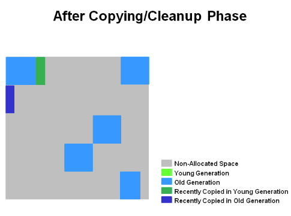

오라클 공식 문서 번역 및 요약.

### 1. G1GC 개요
- G1GC는 multi core processor + 큰 메모리를 사용하는 application을 타겟으로 구현됨
  - 최대 10GB으로 힙크기와 50%의 live object를 가지는 application에 적합
- 최소한의 설정만으로 사용자가 지정한 목표 중지 시간을 달성한다.
  - ex) -XX:MaxGCPauseMillis=200
- Java9 이후부턴 Default GC, 명시적으로 `-XX:+UseG1GC` 옵션으로 활성화 가능
- 이전에 수행한 application의 행동 및 중단 시간들의 통계를 바탕으로 Thoughput을 조절한다.
- CMS vs G1GC
  - 예측 & Compaction

### 2. Heap Layout


- G1GC는 다른 GC들과 다르게, Heap영역을 동일한 크기로 나눈 `region` 이라는 공간으로 관리한다.
  - `-XX:G1HeapRegionSize` 으로 설정 가능, 따로 설정하지 않으면 `( 전체 힙메모리 / 2048 )`으로 자동 설정
  - region 단위로 할당 (allocation) & 회수 (reclamation) 수행됨
  - 각 region은 young generation이 될수도, old generation이 될수도 있음
- Young generation은 Eden(빨간색), Suviver영역 (S 빨간색)으로 구성
- Old generation은 Old region (파란색)으로 구성
  - Old generation은 여러개의 region으로 구성된 Humongous 영역 (L 파란색)으로 구성
  - Homongous object는 Old generation으로 바로 할당됨 (일반적인 object는 young generation에 할당됨)
- Eden -> Survivor -> Aging -> Old 다른 GC와 동작하는 방식은 크게 같다.
- G1GC는 현재 점유하고 있는 region들을 기록하기 위해 RS (remember set)을 만들어 관리한다.
  - RSet은 전체 heap 영역의 5% 미만..
- 각각의 쓰레드 (아마 TLABs?)가 자신의 영역들을 가지고 있고, 병렬로 GC 수행 (빠른 Throughput을 위해..)

### 3. G1GC Cycle


- G1GC는 크게 2 단계를 반복적으로 수행하면서 GC를 수행한다.

#### young-only phase
- space-reclamation phase에서 aging되어 old generation에 임계치(IHOP)에 도달하면 young-only phase에 진입
- young-only phase의 상세한 동작 과정은 아래와 같다..
- Normal young collection -> Concurrent Start young collection

1) Initial Marking Phase


- STW 발생
- Root region과 Old region으로 부터 참조되는 영역들을 마킹하는 단계
  - Old region은 카드 테이블이라는 영역에서 관리..!
- GC log상 `GC pause (young)(inital-mark)`로 표시된다.

2) Concurrent Marking Phase


- Root region& Old region부터 모든 object에 대해서 마킹 진행
  - Normal young collection도 동시에 수행됨
- Application Thread, GC Thread가 동시에 작업을 수행함 (STW 없음)

3) Remark Phase


- STW 발생
- 마킹을 완료하고, 쓰레기 영역을 수집한다.
- 이때, SATB(Snapshot-at-the-beginning) 알고리즘을 사용한다.
  - CMS GC보다 빠른 성능을 보장
4) Cleanup/Copying Phase


- space-reclamation phase이 진입할지, 결정하는 단계
- STW 발생 & Concurrent 수행
- Cleanup / Copying Phase가 수행됨
- Cleanup Phase
  - STW 발생 & Concurrent 수행
  - `liveness` 가장 낮은 객체를 선별 (STW 발생)
  - young & old GC 동시에 발생
    - `[GC pause (mixed)]`로 로깅됨
  - RS 갱신 (STW 발생)
  - `liveness`가 낮은 객체 수집 및 빈 공간 free list로 할당 (Concurrent)
- Copying Phase
  - STW 발생
  - 살아남은 객체를 사용되지 않던 region으로 evacuate & copy
  - 이때, young generation에서 발생하는 [GC pause (young)] 와 young & old generation에서 발생하는 [GC Pause (mixed)] 두 종류의 GC가 발생한다.
5) After Copying/Cleanup Phase


#### space-reclamation phase
- young/old 가리지 않고 라이브 객체를 적절한 곳으로 대피시킨다(Evacuation).
- 작업 효율이 떨어지게 되면 이 페이즈는 끝나고, 다시 Young-only 페이즈로 전환된다.

```text
위 두가지 과정을 통해서 GC를 수행하지만,
(처리율이 만족되지 못하여) 만약 애플리케이션 메모리가 부족한 경우 G1GC는 다른 GC들처럼 Full GC를 수행한다.
```


### G1GC 세부사항
#### Initiating Heap Occupancy Percent (IHOP)
- 전체 heap 중 old generation이 차지하는 점유율을 나타냄
- `young-only phase`의 `Initial Marking Phase`가 발동하기 위한 조건
- IHOP은 option `-XX:-G1UseAdaptiveIHOP`의 설정에 따라 두가지 동작 방식을 가짐
1) -XX:-G1UseAdaptiveIHOP = true (default)
- 처음에는 `-XX:InitiatingHeapOccupancyPercent`로 설정된 값이 `young-only phase`의 진입 조건이 되지만...
- 이후, 발생하는 통계치 정보들을 토대로 G1GC가 최적화된 임계치를 지정하고, 그 값에 따라 동작한다.
  - 통계치는 old generation에서 진행되는 marking 단계에서 ***얼마나 마킹 작업이 소요됐는지***, ***얼마나 많은 메모리가 할당됐는지***에 대한 정보이다.
- IHOP은 `-XX:G1HeapReservePercent` 설정된 값의 나머지 부분으로 점유율을 계산한다.
2) -XX:-G1UseAdaptiveIHOP = false
- `-XX:InitiatingHeapOccupancyPercent`로 설정된 값이 항상 `young-only phase` 진입의 조건이 된다.

#### Snapshot-at-the-beginning (SATB)
- G1GC는 `Initial Marking Phase`에서 snapshot을 만들어서 마킹 작업을 한다.
- snapshot 시점의 live 객체이기 때문에, 마킹 하는 과정중에 죽은 객체가 될 수도 있다.
- 하지만, SATB 알고리즘에 의해서 Remark 단계의 응답 시간(latency)을 보여준다.

#### Behavior in Very Tight Heap Situations (힙공간이 충분치 않을때의 행동)
- 애플리케이션이 너무 많은 양의 메모리를 쓰고 있어서, 객체를 대피시킬 때 복사할만한 공간이 충분하지 않으면 대피 실패(Evacuation Failure)가 발생한다.
- 대피 실패가 발생하면, 이미 이동시킨 객체는 새 위치 그대로 유지하고, 아직 이동하지 않은 객체는 복사하지 않는다.
- 이때, G1GC는 비록 아직 이동하지 못한 객체가 있더라도, application이 동작을 수행하기에 가용한 메모리가 확보되었다고 생각하고 동작한다.
- 대부분의 상황에서는 이 가정이 맞지만, 힙공간이 충분치 않은 application은 아니다. 이때, Full GC가 발생한다.

#### Humongous Object
- region의 절반 이상의 크기를 가진 객체
  - `-XX:G1HeapRegionSize` 옵션에 영향을 받음 / 따로 지정하지 않으면 `(heap size / 2048)`
- 크기가 커서 n개의 연속적인 영역을 사용할 수도 있다.
- 이때, 할당 받지 못한 나머지 영역은 잉여 공간으로 남겨둔다. (낭비)
  - ex) region size 16BM이고 object size 40MB일때,
  - 이 객체는 총 3 region(48MB)을 사용하고, 잉여 공간은 8MB이다.
- Humongous Object는 old generation으로 바로 할당된다.
- GC가 발생해도 옮겨지지 않는다. 그로인해, 조각화가 발생할 수 있다.
  - 그 결과, 공간이 충분한데도 메모리 부족 상태가 발생할 수 있고 Full GC가 느려질 수 있다.


### G1GC options


https://docs.oracle.com/en/java/javase/11/gctuning/garbage-first-g1-garbage-collector1.html#GUID-082C967F-2DAC-4B59-8A81-0CEC6EEB9016

### 참고자료
- https://docs.oracle.com/en/java/javase/11/gctuning/garbage-first-g1-garbage-collector1.html#GUID-ED3AB6D3-FD9B-4447-9EDF-983ED2F7A573
- https://www.oracle.com/technetwork/tutorials/tutorials-1876574.html
- https://johngrib.github.io/wiki/java-g1gc/
