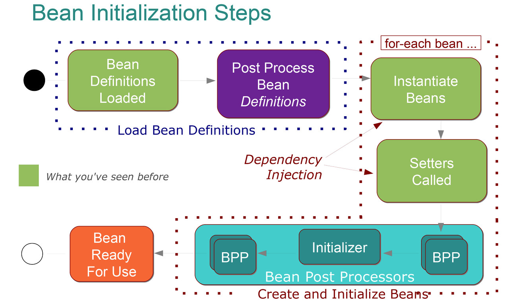
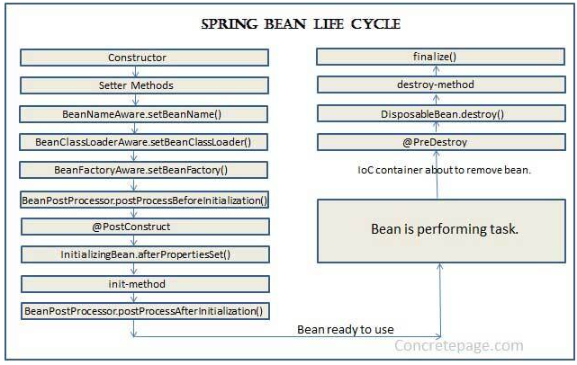

## Spring 빈 생명주기

스프링이 빈을 생성하는 흐름은 다음과 같다.
  1. 빈 설정 메타정보 로딩
  2. BeanFactoryPostProcessor 구현 class 수행
  3. 빈 대상인 POJO를 인스턴스화
  4. 인스턴스화된 빈들에 의존성 주입
  5. 초기화 작업 진행
  6. 스프링 컨테이너에 빈 등록
- 1, 2 : 한번에 수행
- 3 ~ 6 : 각 bean 마다 하나씩 수행




### 빈 설정 메타정보 로딩
- 빈을 생성하기 위한 메타정보를 로딩
  - XML, Property, Annotation 등 으로 작성된 빈 설정 메타정보
- BeanFactoryPostProcessor 를 구현한 클래스들이 메타정보 로딩 후 수행된다. (빈 인스턴스화 전에 수행)
```java
public interface BeanFactoryPostProcessor {
	void postProcessBeanFactory(ConfigurableListableBeanFactory beanFactory) throws BeansException;
}
```

### 초기화 작업 진행
- POJO에서 인스턴스화된 빈에 대해서 추가적인 작업을 하는 단계
- `BeanPostProcessor` 를 구현한 클래스들에서 수행
  - `DefaultAdvisorAutoProxyCreator` 를 사용해 ***자동 프록시 생성***
  - `@PostConstruct` / `init-method` / `InitializingBean.afterPropertiesSet()`는 postProcessBeforeInitialization() 이후에 수행됨


팀에서 사용되는 SDK 구현을 위해서 찾아보기 시작한 내용이다. 사실 토비의 스프링을 읽을때 봤던 내용들이라 어렴풋이 인지는 하고 있었다.
읽기만하고 정리를 해두지 않으니, 활용하지 못하고 있었다.
추후 스프링에 대해서 하나씩 정리하면서 내용들 다시 채워나가야겠다. 곧....!!!

## 참고 자료
- https://mangkyu.tistory.com/214
- https://js2prince.tistory.com/entry/Spring-%EB%B9%88-%ED%9B%84%EC%B2%98%EB%A6%AC%EA%B8%B0
- https://nankisu.tistory.com/5
