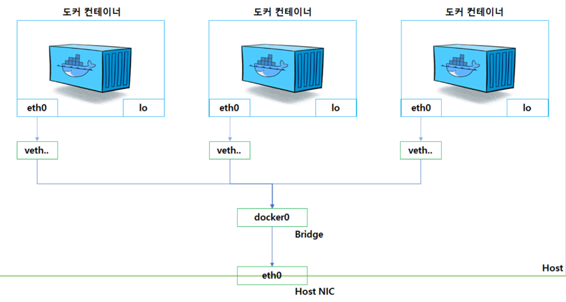

### 도커 네트워크 구조

- 도커는 컨테이너에 내부 IP를 순차적으로 할당 (eth0로 할당 / 172.17.0.x)
- 내부 IP는 컨테이너가 재시작 할때마다 변경 될 수 있음
- 컨테이너의 내부 IP를 외부로 연결시켜주는 가상 네트워크 인터페이스가 있음 -> veth0
- veth0는 docker0 브릿지를 통해서 host의 eth0와 바인딩되어 있으며, 외부로 통신이 가능함

### 도커 네트워크 기능
- 기본적으로 앞서 설명한 docker0 브릿지를 통해서 외부와 통신 할 수 있지만,
- `bridge, host, none, container, overlay` 등으로도 외부와 연결 가능

#### host
- docker run -i -t --name host_container --net host ubuntu:latest
- 시작하면, host의 네트워크 환경을 그대로 사용 가능

#### none
- docker run -i -t --name host_container --net none ubuntu:latest
- 아무런 네트워크를 사용하지 않는 설정

#### container
- docker run -i -t --name host_container --net container:[컨테이너 이름] ubuntu:latest
- `docker run -i -t --name host_container --net container:[host_container] ubuntu:latest`
- 다른 컨테이너의 내부 IP / Mac 주소 등 네트워크 네임스페이스를 공유
