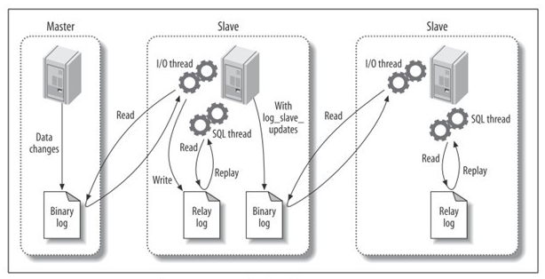

Replication(복제)는 한 서버에서 다른 서버로 데이터가 동기화 되는 것을 말하며,
원본 데이터를 가진 서버스를 **소스 서버**, 복제된 데이터를 가지는 서버를 **레플리카 서버**라고 부른다.

레플리카 서버를 구축하는 목적으로는
1. 스케일 아웃 (Throughput 향상)
2. 데이터 백업 (문제가 생겼을 때를 대비한 Standby)
3. 데이터 분석 (분석용 쿼리 실행을 위한)
4. 데이터의 지리적 분산 (재해에 대비한 분산 복제, 애플리케이션 서버와 가까이 위치하게끔 하여 빠른 응답 속도)

### MySQL 복제 아키텍쳐
#### 복제 순서
1. 소스 서버의 모든 변경 사항은 ***바이너리 로그***에 기록
   - 데이터 변경 내역, 데이터베이스/테이블 구조의 변경, 계정이나 권한 변경 등 기록
2. 소스 서버에 생성된 바이너리 로그는 레플리케이션 서버로 전송
3. 레플리케이션 서버는 전달 받은 바이너리 로그를 ***릴레이 로그***로 로컬 디스크에 저장



#### 주요 스레드
- 바이너리 로그 덤프 스레드
  - **바이너리 로그**의 내용을 **레플리카 서버로 전송**
  - 레플리카 서버로 보낼 각 이벤트를 읽을 때 일시적으로 바이너리 로그에 잠금을 수행
  - 이벤트를 읽고난 후 바로 잠금 해제
  - `SHOW PROCESSLIST` 명령으로 확인 가능

- 레플리케이션 I/O 스레드
  - 소스 서버의 받은 **바이너리 로그 이벤트**를 **릴레이 로그에 저장**하는 역할
  - `SHOW REPLICA STATUS` 명령에서 `Replica_IO_Running` 컬럼의 값으로 확인

- 레플리케이션 SQL 스레드
  - 릴레이 로그의 이벤트를 읽고 실행
  - `SHOW REPLICA STATUS` 명령에서 `Replica_SQL_Running` 컬럼 값으로 확인

#### 관리 데이터
복제가 시작되면 레플리카 서버는 세 가지 유형의 데이터를 생성 및 관리
- 릴레이 로그
  - 다음 정보가 저장된다.
    - 소스 서버의 바이너리 로그에서 읽어온 이벤트
    - 릴레이 로그 파일들의 목록이 담긴 인덱스 파일
- 커넥션 메타데이터
  - 다음 정보가 저장된다.
    - 레플리케이션 I/O 스레드에서 소스 서버로 연결할 때 사용되는 DB 계정 정보
    - 현재 읽고 있는 소스 서버의 바이너리 파일명과 파일 내 위치 값
  - mysql.slave_master_info 테이블에 저장됨
- 어플라이어 메타데이터
  - 다음 정보가 저장된다.
    - 최근 적용된 이벤트의 릴레이 로그 파일명 / 파일 내 위치 정보
  - mysql.slave_relay_log_info 테이블에 저장됨

---

## 복제 타입
MySQL 복제는 **바이너리 로그**에 기록된 **변경 내역들을 식별하는 방식**에 따라,
1. 바이너리 로그 파일 위치 기반 복제
2. 글로벌 트랜잭션 ID 기반 복제

두 가지가 존재 한다.

### 바이너리 로그 파일 위치 기반 복제
- 소스 서버의 **바이너리 로그 파일명**과 **파일 내에서의 위치(Offset)**로 개별 바이너리 로그 이벤트를 식별해서 복제가 진행되는 형태
- 레플리카 서버는 소스 서버의 어느 이벤트까지 릴레리 로그에 저장 했는지 정보를 관리하며,
- 해당 정보를 이용해 바이너리 로그 이벤트를 가져온다.

#### 바이너리 로그 파일 위치 기반 복제 구축
- 소스 서버 설정
  - 복제 구성원이 되는 MySQL 서버는 고유한 server_id를 가져야 한다.
  - 데이터 디렉터리 밑에 `binlog` 라는 이름으로 바이너리 로그 파일이 자동으로 생성
    - 로그 파일 위치나 파일명을 따로 설명하려면, `log_bin` 시스템 변수를 통해 설정 가능
  - 바이너리 로그 동기화 방식, 캐시하기 위한 메모리 크기, 파일 크기, 보관 주기 등 지정 가능
  - `SHOW MASTER STATUS` 명령으로 상태 확인 가능
```properties
[mysqld]
server_id=1
log_bin=/binary-log-dir-path/binary-log-name
sync_binlog=1
binlog_cache_size=5M
max_binlog_size=512M
binlog_expire_logs_seconds=1209600
```

- 레플리카 서버 설정
  - 중복되지 않는 고유한 server_id만 설정
  - `relay_log` 시스템 변수로 **릴레이 로그 파일 위치나 파일명을 따로 설정**
  - 적용된 릴레이 로그 이벤트는 자동으로 삭제됨
    - 유지하고자 한다면 `relay_log_purge` 시스템 변수 `OFF`로 설정
  - 레플리카 서버는 읽기 전용으로 많이 사용됨
    - 시스템 변수 `read_only` 활성화
  - 소스 서버 장애로 소스 서버로 승격 될 수 있으니, `log_slave_updates` 시스템 변수 명시
    - 복제에 의한 변경 사항을 그대로 바이너리 로그에 기록
```properties
[mysqld]
server_id=2
relay_log=/relay-log-dir-path/relay-log-name
relay_log_purge=ON
read_only
log_slave_updates
```

- 복제 계정 준비
  - 복제용 계정은 레플리카 서버에서 소스 서버로 연결하여 바이너리 로그 이벤트를 수신하기 위해 사용
  - `REPLICATION SLAVE` 권한을 가지고 있어야 함
```roomsql
CREATE USER 'repl_user'@'%' IDENTIFIED BY 'repl_user_password';
GRANT REPLICATION SLAVE ON *.* TO 'repl_user'@'%';
```

#### 글로벌 트랜잭션 아이디(GTID) 기반 구축

---
