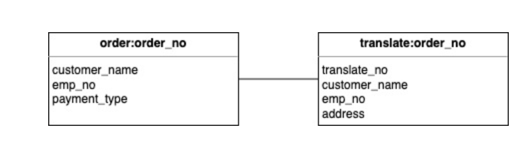
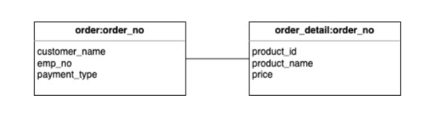
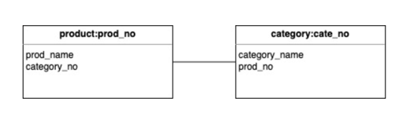
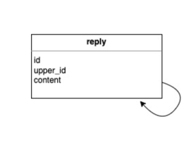

## 용어 설명
> RDBMS 와 비교했을때, Redis 에서 사용되는 용어는 아래와 같다.

- Redis 용어 (RDBMS 용어) : 설명

- Table (Table) : 데이터를 저장하는 논리적 구조 집합
- Field/Element (Column) : 하나의 테이블을 구성하는 요소
- Key (Primary Key) : 테이블 내 Row 들을 식별하는 요소
- HyperLogLogs (Check Constraint) : 하나의 Field 에 저장되는 데이터의 값을 제약하는 조건
- NOT NULL, NULL, UNIQUE 와 같은 제약조건 기능은 redis 에서는 제공 되지 않는다.

## 데이터 모델링
### Hash-Hash 데이터 모델
- RDBMS 에서 ***부모-자식 (Parent-Child) 관계*** 와 유사
- 부모가 있어야 자식이 있는 구조
- 부모 -> 자식, ***HAS A 관계***
- 

```shell
# Parent(주문)
127.0.0.1:6379> hset order:20220801 customer_name "assu" emp_no 1111 payment_type 'credit'
(integer) 3
127.0.0.1:6379> hgetall order:20220801
1) "customer_name"
2) "assu"
3) "emp_no"
4) "1111"
5) "payment_type"
6) "credit"


# Child(운송)
127.0.0.1:6379> hset translate:20220801 translate_no 1112 customer_name 'assu' emp_no 1111 address 'seoul'
(integer) 4
127.0.0.1:6379> hgetall translate:20220801
1) "translate_no"
2) "1112"
3) "customer_name"
4) "assu"
5) "emp_no"
6) "1111"
7) "address"
8) "seoul"
```
### Hash-List 데이터 모델
- RDBMS 에서 ***마스터-디테일 관계*** 와 유사
- ***공통된 요소인 마스터 테이블***과 ***세부사항을 디테일 테이블***을 이용해서 구현 가능
- ex) 주문 테이블은 주문번호, 고객명 등과 같은 공통적인 데이터를 담는 마스터 테이블과 주문의 상세 항목들을 담는 Detail 테이블로 구성됨
- 
```shell
# Master(주문공통)
127.0.0.1:6379> hset order:20220802 customer_name 'assu' emp_no 1111 payment_type 'credit'
(integer) 3
127.0.0.1:6379> hgetall order:20220802
1) "customer_name"
2) "assu"
3) "emp_no"
4) "1111"
5) "payment_type"
6) "credit"


# Detail(주문상세)
127.0.0.1:6379> lpush order_detail:20220802 '<product_id>1</product_id><product_name>mirror</product_name><price>2,000</price>' '<product_id>2</product_id><product_name>apple</product_name><price>5,000</price>'
(integer) 2
127.0.0.1:6379> lrange order_detail:20220802 0 -1
1) "<product_id>2</product_id><product_name>apple</product_name><price>5,000</price>"
2) "<product_id>1</product_id><product_name>mirror</product_name><price>2,000</price>"
```

### List-List 데이터 모델
- ***N-M 관계*** 에 해당
- 

```shell
127.0.0.1:6379> lpush product:p111 '{prod_name: apple, cate_no: c111}'
(integer) 1
127.0.0.1:6379> lrange product:p111 0 -1
1) "{prod_name: apple, cate_no: c111}"

127.0.0.1:6379> lpush category:c111 '{category_name: fruit, prod_no: p111}'
(integer) 1
127.0.0.1:6379> lrange category:c111 0 -1
1) "{category_name: fruit, prod_no: p111}"
```

### Set/Sorted Set-List 데이터 모델
- RDBMS 에서 ***계층형 관계*** (Tree Structure) 에 해당
- Self-Reference 관계
- ex) 사원 테이블은 사원 번호, 상관 사원번호의 컬럼으로 구성되어 있으며, 두개의 값에 의해 상호 참조 가능한 구조이다.
- 
```shell
127.0.0.1:6379> sadd reply:1 'id:1, upper_id:0, content:test111' 'id:2, upper_id:1, content:test111-1'

(integer) 2
127.0.0.1:6379> smembers reply:1
1) "id:1, upper_id:0, content:test111"
2) "id:2, upper_id:1, content:test111-1"
```

## 기타 설계 기법
### Striping 기법
- 데이터의 안전한 저장 및 관리를 위해 ***분산 저장 기술***
- redis.conf 내 `databases` 파라미터로 갯수 설정 가능
- 하나의 데이터베이스에 모든 정보를 저장하면
  - 예기치 못한 상황이 발생 했을때 복구가 쉽지 않음
  - Lock 기능에 의해 성능 저하가 발생함
```shell
### 기본값은 16
databases 16
```

### SwapDB 기법
- 데이터베이스의 로컬 데이터를 서로 변경하는 기법
- 명령어 실행시 접속된 모든 클라이언트들에 영향을 미친다
- 빅데이터 처리시 사용?
```shell
127.0.0.1:5050> keys *
(empty array)
127.0.0.1:5050> select 15
OK
127.0.0.1:5050[15]> keys *
1) "order:1013"
127.0.0.1:5050[15]> swapdb 0 15
OK
127.0.0.1:5050[15]> keys *
(empty array)
127.0.0.1:5050[15]> select 0
OK
127.0.0.1:5050> keys *
1) "order:1013"
```

### References
- https://www.joinc.co.kr/w/man/12/REDIS/DataModeling
- https://www.slideshare.net/Byungwook/redis-data-modeling-examples

